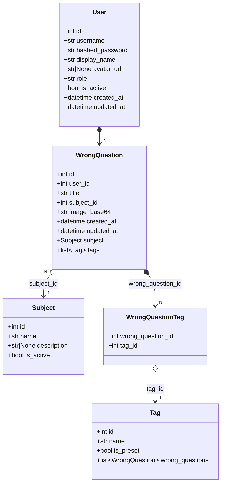

# Architecture Documentation

## Domain Model Class Diagram

## Domain Model Description

### Entities

| Entity | Description | Key Fields |
| :--- | :--- | :--- |
| **User** | 用户实体，用于身份认证和用户管理 | username, hashed_password, display_name, role, is_active |
| **WrongQuestion** | 错题核心实体，存储学生错题图片及相关信息 | title, image_base64, user_id, subject_id |
| **Subject** | 学科分类实体，用于对错题进行学科归类 | name, description, is_active |
| **Tag** | 标签实体，提供灵活的错题标记方式 | name, is_preset |

### Domain Services

| Service | Responsibility |
| :--- | :--- |
| **AuthService** | 用户认证、用户数据转换 |
| **WrongQuestionService** | 错题的 CRUD 操作及关联关系管理 |
| **SubjectService** | 学科管理 |
| **TagService** | 标签管理（预设标签和自定义标签） |
